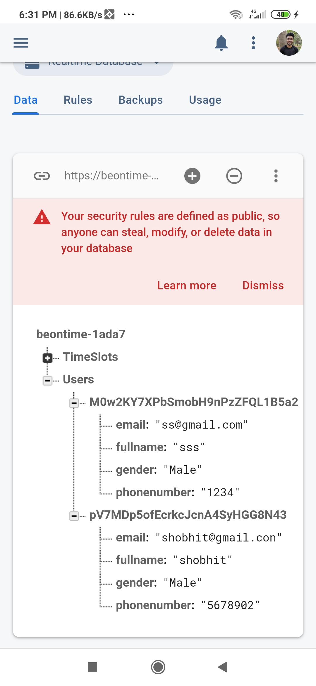
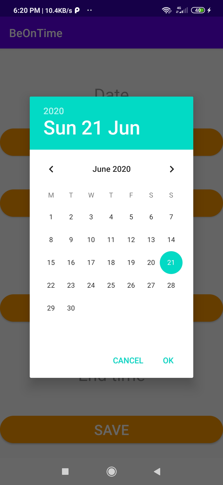
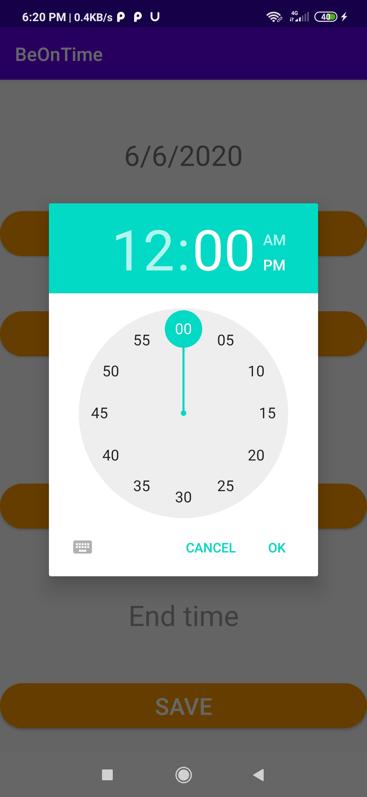

# BeOnTime
time management app

Description:

This is a simple app for slot booking.In this i have introduced user authentication via firebase authentication and used date time picker
for selecting the slots and saving them in firebase realtime database.

Demo:

User Authentication:

    
### User Data Stored In Cloud Firestore

### Adding Slots
  
 

### Slot Information Stored in Firebase RealTime Database

### View Slot details and Perform Delete Operation
  

